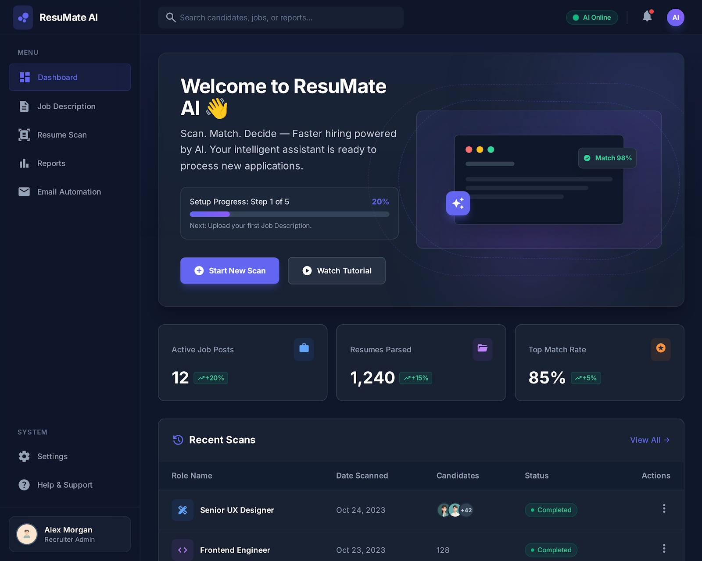
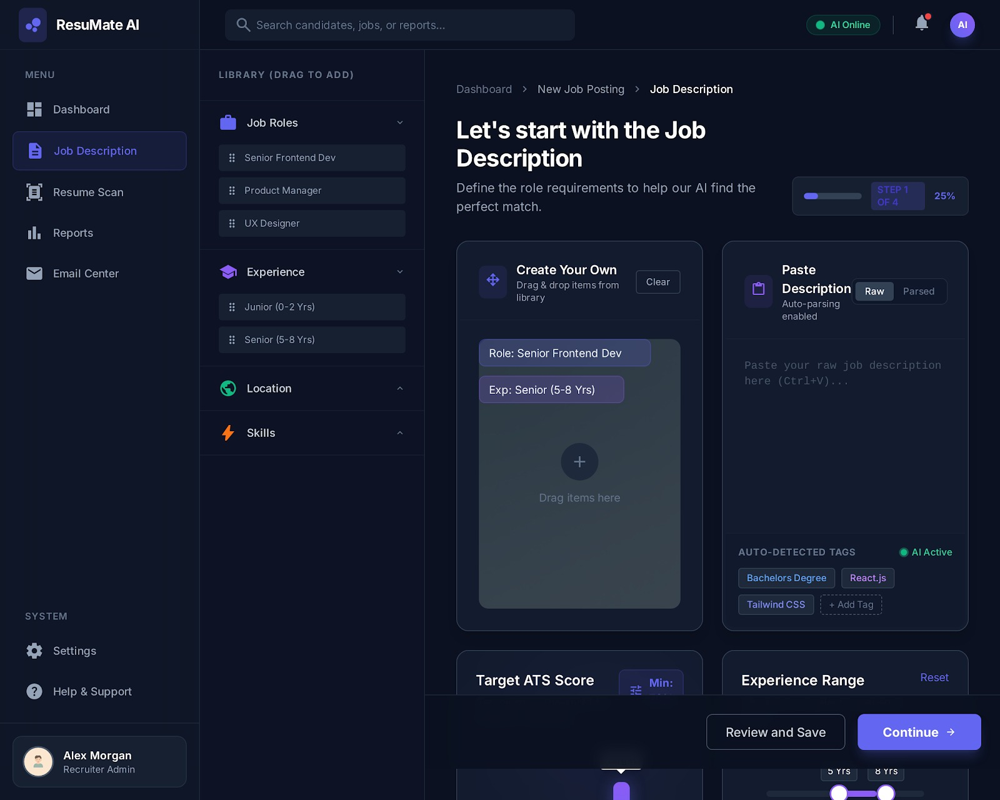
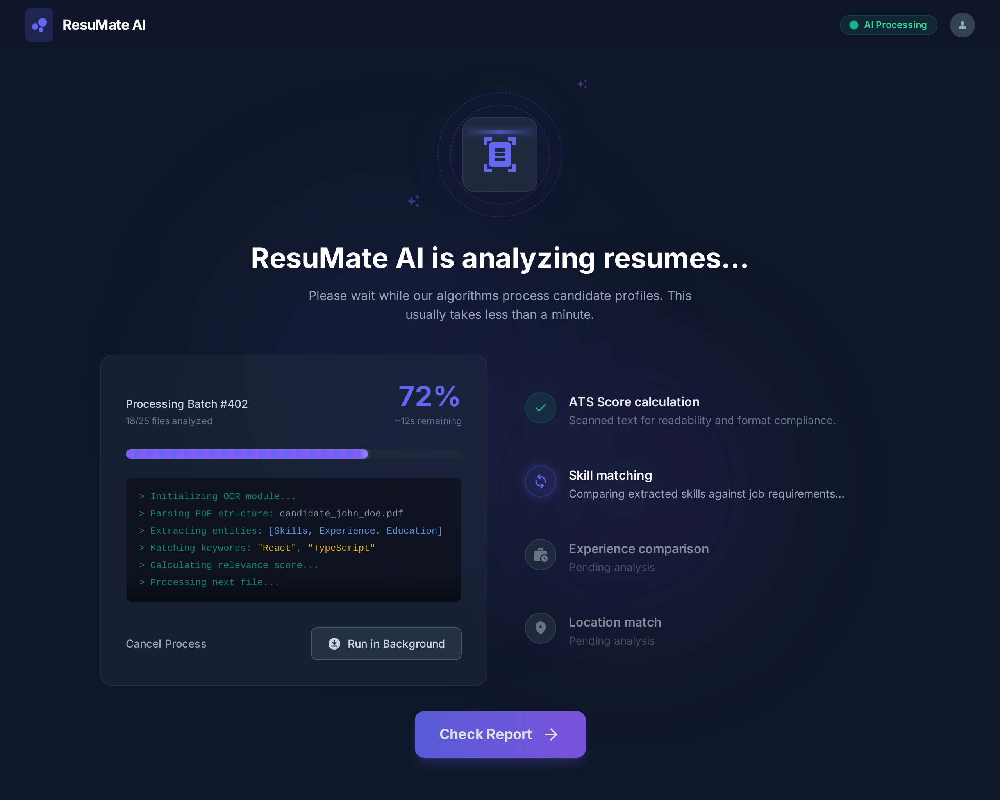
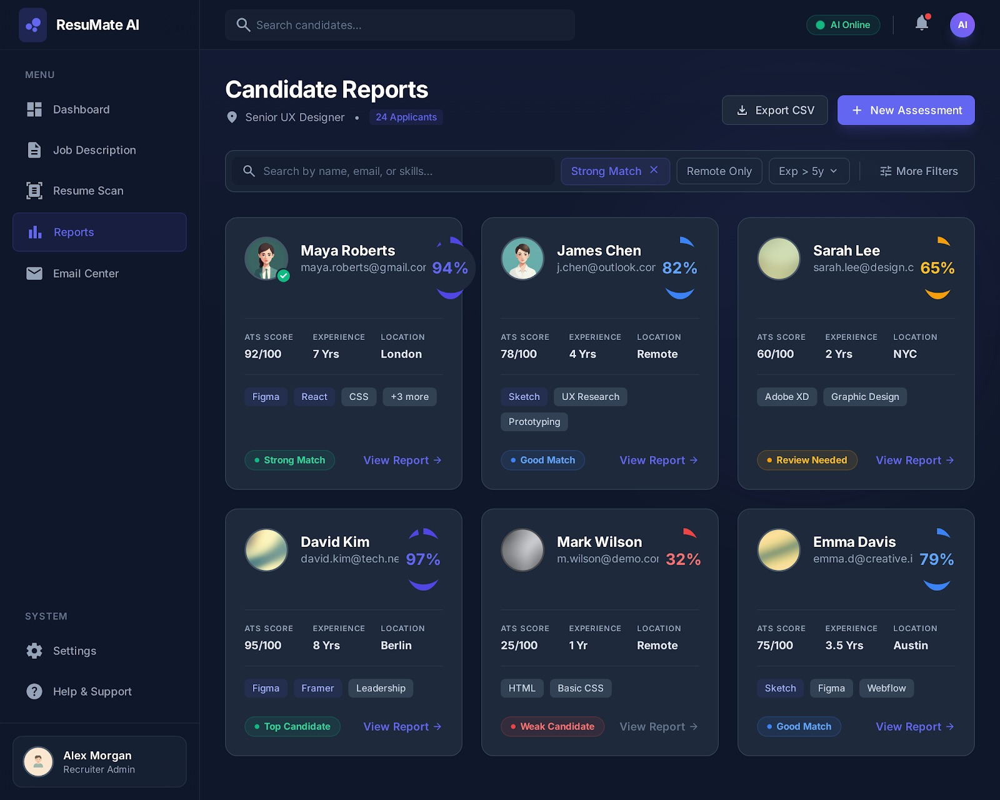
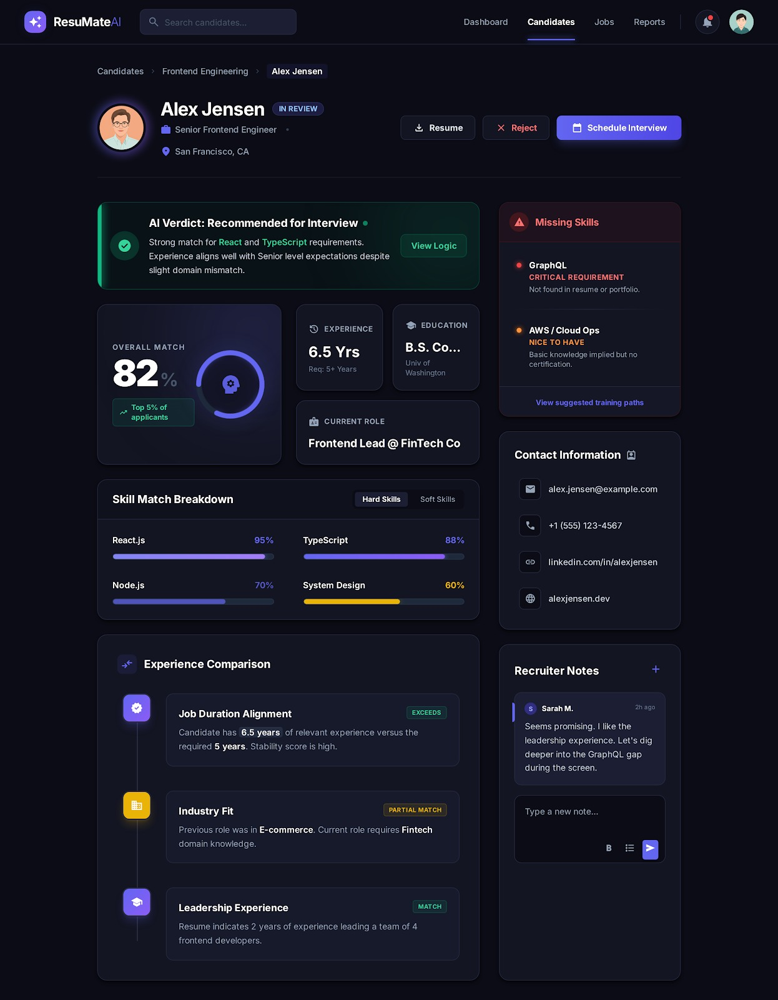

# ResuMate – AI Powered Recruitment Automation Platform

## 1. Introduction

### 1.1 Purpose of the Document

This document provides complete and detailed documentation for **ResuMate**, an AI-powered recruitment and resume analysis tool.

It is intended for:
- Product stakeholders
- HR teams and recruiters
- Developers and technical teams
- Management and decision makers

The documentation explains what the tool does, how it works, and how users interact with it, in a professional and easy-to-understand manner.

### 1.2 Product Overview

**ResuMate** is an intelligent recruitment platform designed to help HR teams and recruiters automatically identify the most suitable candidates for a specific job role using Artificial Intelligence.

The platform:
- Analyzes job descriptions and resumes
- Calculates ATS (Applicant Tracking System) scores
- Matches skills and experience
- Generates clear candidate reports — all with minimal manual effort

The frontend UI is built using **React**, while AI and automation handle resume parsing, scoring, and matching in the backend using **N8N**.

---

## 2. Key Objectives of ResuMate

- [x] Reduce manual resume screening time
- [x] Improve hiring accuracy and consistency
- [x] Eliminate bias through data-driven evaluation
- [x] Provide ATS-compliant scoring and insights
- [x] Enable faster shortlisting and decision-making

---

## 3. User Roles

### 3.1 Recruiter / HR Admin

**Responsibilities:**
- Create job descriptions
- Upload or receive resumes via email or bulk upload
- Initiate resume scanning
- View candidate reports and scores
- Export reports and manage hiring data

### 3.2 System (AI Engine)

**Responsibilities:**
- Parse job descriptions
- Extract resume data
- Match skills, experience, and keywords
- Calculate ATS and match scores
- Generate structured reports

---

## 4. Application Flow Overview

```
Recruiter logs into ResuMate
        ↓
Creates or uploads a job description
        ↓
Adds candidate resumes (email or bulk upload)
        ↓
AI processes and analyzes resumes
        ↓
System generates ATS scores and match results
        ↓
Recruiter reviews candidate reports
        ↓
Final shortlisting decision is made
```

---

## 5. Dashboard Module

### 5.1 Dashboard Overview



The **dashboard** is the central control panel of ResuMate. It provides a real-time overview of recruitment activity.

This is the main dashboard (home screen) of **ResuMate AI**, an AI-driven hiring assistant that helps recruiters:
- Upload job descriptions
- Scan and parse resumes
- Match candidates using AI
- Track hiring metrics
- Automate recruitment workflows

#### 5.1.1 Key Components

**Search Bar**
- Global search across candidates, job descriptions, and reports
- Improves recruiter productivity

**AI Status Indicator**
- "AI Online" badge shows AI engine availability
- Builds user trust in automation

**Notifications**
- Bell icon for scan completion, new candidate matches, and system alerts

**User Profile**
- Profile picture with account settings, logout, and preferences

### 5.2 Left Sidebar Navigation (Main Menu)

#### MENU Section

| Feature | Purpose |
|---------|---------|
| **Dashboard** | Overview of system metrics |
| **Job Description** | Create or upload job descriptions for AI matching |
| **Resume Scan** | Upload resumes and trigger AI parsing & scoring |
| **Reports** | Hiring analytics, match performance, and recruiter insights |
| **Email Automation** | Automated candidate emails, interview invites, rejections, and follow-ups |

#### SYSTEM Section

| Feature | Purpose |
|---------|---------|
| **Settings** | AI thresholds, matching rules, user preferences |
| **Help & Support** | Tutorials, FAQs, and support contact |

---

## 6. Job Description Module

### 6.1 Purpose

This module allows recruiters to define role requirements, which serve as the foundation for AI-based resume matching.

### 6.2 Job Description Creation Methods

#### Option 1: Create Your Own

- Drag and drop role elements from the library
- Select job role (e.g., Senior Frontend Developer)
- Define experience range
- Add location and required skills

#### Option 2: Paste Description

- Paste raw job description text
- AI automatically parses and extracts:
  - Skills
  - Education
  - Experience
  - Keywords

### 6.3 Navigation & Context (Top Area)

**Breadcrumb:** Dashboard → New Job Posting → Job Description

Shows where the user is in the workflow and confirms this is part of a multi-step job posting process.

### 6.4 Left Sidebar – JD Component Library (Drag & Drop)

**Library Contents:**

| Category | Examples | Purpose |
|----------|----------|---------|
| **Job Roles** | Senior Frontend Dev, Product Manager, UX Designer | Predefined role templates |
| **Experience** | Junior (0–2 yrs), Senior (5–8 yrs) | Helps AI understand seniority level |
| **Location** | Various cities/regions | Enables geo-based candidate filtering |
| **Skills** | Technical & soft skills | Crucial for ATS scoring |

### 6.5 Middle Panel – "Create Your Own" JD Builder

**Purpose:** Build the job description visually with standardized components.

**Features:**
- **Selected Components** – Display chosen role and experience
- **Drag Area** – Add skills, location, education, and responsibilities
- **Clear Button** – Reset the JD structure

**Why it matters:**
- Ensures standardized job descriptions
- Improves AI matching accuracy
- Avoids vague job descriptions

### 6.6 Right Panel – Paste Job Description (Raw Input)

**Paste Description Section**
- Supports raw and parsed views
- AI automatically extracts skills, experience, education, and tools & technologies

**Benefits of dual approach:**
- Manual drag-drop for structured input
- AI parsing for flexible, raw JD text
- Works for all recruiter preferences

### 6.7 Bottom Action Buttons

| Button | Action |
|--------|--------|
| **Review and Save** | Saves JD as draft for later editing |
| **Continue →** | Moves to next step (Resume Scan / Matching) |



---

## 7. Resume Scan Module

### 7.1 Purpose

This module is used to import candidate resumes into the system for analysis.

### 7.2 Resume Upload Methods

#### 7.2.1 Upload via Email

Allows recruiters to forward resumes directly via email.

**Common Use Cases:**
- Candidates email resumes directly
- Recruiters receive resumes from job portals
- External agencies share profiles

**Functionality:**
- Any resume sent to this email is automatically captured
- Parsed by AI
- Linked to the correct job posting

#### 7.2.2 Bulk Upload

**Features:**
- Drag & drop multiple files
- Browse from local system
- Supports large batch uploads

**Use Cases:**
- Campus hiring
- Walk-in interviews
- Vendor-provided resume folders

### 7.3 Action Buttons (Bottom Right)

| Button | Action |
|--------|--------|
| **Cancel** | Discards current upload session (no data processed) |
| **Scan Resumes** | Triggers AI resume parsing and scoring |


---

## 8. AI Resume Processing Engine

### 8.1 Purpose

This page informs the recruiter that AI is actively processing resumes and performing:
- Resume text extraction
- ATS compliance checks
- Skill matching
- Experience comparison
- Location matching

### 8.2 Processing Batch Card (Left Section)

Indicates batch-based processing and scalable architecture for bulk resumes.

### 8.3 AI Analysis Pipeline (Right Section)

Shows which AI modules are active or pending.

### 8.4 Call-to-Action Button

**Check Report →**
- Becomes active once processing completes
- Navigates to:
  - Candidate ranking
  - ATS scores
  - Match percentages
  - Detailed AI insights



---

## 9. Candidate Reports Module

### 9.1 Purpose

The Candidate Reports page allows recruiters to:
- View AI-scored candidates for a specific role
- Compare ATS scores, experience, and location
- Filter candidates using AI-powered criteria
- Identify top, strong, good, and weak matches
- Drill down into detailed AI reports

### 9.2 AI Filters (Quick Chips)

| Filter | Purpose |
|--------|---------|
| **Strong Match** | Pre-filtered high-match candidates |
| **Remote Only** | Location-based filtering |
| **Exp > 5y** | Experience level filtering |
| **More Filters** | Additional criteria options |

These enable AI-assisted shortlisting in seconds.

### 9.3 Export & Actions

| Action | Purpose |
|--------|---------|
| **Export CSV** | Download candidate data for sharing |
| **+ New Assessment** | Trigger additional AI tests or evaluations |

### 9.4 Candidate Card Details

Each candidate card displays:
- Candidate name and email
- ATS score
- Experience (years)
- Location
- Matched skills

### 9.5 AI Match Classification Badges

| Badge | Meaning |
|-------|---------|
| **Top Candidate** | Excellent fit for the role |
| **Strong Match** | High compatibility |
| **Good Match** | Solid fit with minor gaps |
| **Review Needed** | Requires manual evaluation |
| **Weak Candidate** | Limited match for the role |



---

## 10. Reports & Analytics (Candidate Detail)

### 10.1 Purpose

The Candidate Detail page helps recruiters:
- Understand why a candidate was shortlisted
- Review AI match logic and transparency
- Identify skill gaps and strengths
- Make interview/reject decisions confidently
- Add recruiter notes and collaboration input

### 10.2 Header & Candidate Identity

**Primary Actions:**
- **Resume** – Download or view resume
- **Reject** – Move candidate to rejection workflow
- **Schedule Interview** – Trigger interview scheduling + email automation

### 10.3 Overall Match Summary

Composite score calculated from:
- ATS score
- Skill match
- Experience alignment
- Industry relevance
- Location fit

### 10.4 Candidate Snapshot Cards

Quick professional context including:
- **Experience** – Current and past roles
- **Education** – Degrees and certifications
- **Current Role** – Job title and company

### 10.5 Missing Skills Panel (Risk Awareness)

**Skill Categories:**
- **Critical Requirements Missing** – Must-have skills gaps
- **Nice to Have** – Optional skill gaps

**AI-Powered Recommendations:**
- View suggested training paths
- Recommend learning resources for upskilling

### 10.6 Skill Match Breakdown

Visual representation of:
- **Hard Skills** – Technical competencies
- **Soft Skills** – Interpersonal abilities

Matches shown as percentage bars for quick assessment.

### 10.7 Contact Information Panel

- Email address
- Mobile number
- LinkedIn profile
- Portfolio website

### 10.8 Recruiter Notes (Collaboration Layer)

**Features:**
- Timestamped notes with recruiter names
- Multi-recruiter collaboration
- Decision documentation for audit trails



---

## 11. Email Automation Module

### 11.1 Purpose

The Email Automation page allows recruiters to:
- Send AI-generated emails to candidates
- Customize offer, selection, or rejection emails
- Maintain consistent, professional communication
- Reduce manual emailing effort
- Trigger hiring workflows automatically

### 11.2 Key Features and Functionalities

#### Candidate Summary Card

**Candidate Details:**
- Name
- Email
- Role
- Match Score
- Interview Status

**View Profile Button** – Opens full candidate profile for quick cross-verification

#### Email Type Selection

**Tabs:**
- **Selection Email** (Active) – Offer and acceptance communications
- **Rejection Email** – Rejection or fallback communications

Quick switching between email types for efficient communication.

#### Editable Email Composer

- Customize recipients, subject, and email content
- Supports basic text formatting for personalization

#### AI Editing Controls

| Control | Function |
|---------|----------|
| **Make Friendlier** | Adjusts tone to be more conversational |
| **Shorten** | Reduces length while keeping key information |

#### Status Indicators

- **"AI Draft Ready"** – Email is prepared and ready to send
- **"AI Online"** – AI services are active and available


---

## 12. System Architecture

### 12.1 Frontend Architecture (React)

**Technology Stack:**
- React.js
- Component-based architecture
- Reusable UI components
- State management (Context / Redux)

**UI Principles:**
- Dark, modern UI design
- High readability and contrast
- Minimal learning curve
- Responsive design for all devices

### 12.2 Backend Architecture

**Technology Stack:**

| Component | Technology | Purpose |
|-----------|-----------|---------|
| **Workflow Automation** | n8n | Resume processing and AI orchestration |
| **Business Logic** | Java | Service layer and business rules |
| **Database** | MongoDB | Resume, job, and candidate data storage |
| **Communication** | REST APIs | Secure frontend-backend interaction |

**Backend Responsibilities:**
- Resume ingestion and processing workflows
- AI resume parsing and ATS score calculation
- Job–resume matching logic
- Report generation and data export
- Email automation and background processing

### 12.3 Frontend–Backend Interaction

**Workflow:**
1. Frontend communicates with backend via secure REST APIs
2. Backend processes requests and triggers n8n workflows
3. MongoDB stores structured resumes, scores, and reports
4. Results are returned to frontend in real-time for user display

### 12.4 System Architecture Diagram


**Components Illustrated:**
- Frontend layer (React UI, State Management, HTTP Client)
- API Gateway with REST endpoints
- Backend microservices (Job Description, Resume Parsing, Matching, Reports, Email)
- Workflow orchestration (n8n)
- MongoDB data layer
- External AI/LLM and email service integrations

### 12.5 Resume Processing Workflow


**Workflow Steps:**
1. Recruiter uploads resumes
2. Files stored temporarily
3. n8n workflow triggered
4. Text extraction from PDF/DOCX
5. Data parsing (Name, Email, Experience)
6. Skill and technology extraction
7. ATS score calculation
8. Data storage in MongoDB
9. Candidate report generation
10. Frontend update with results
11. Display in Reports module

### 12.6 Job-Resume Matching Flow


**Matching Process:**
1. Job Description received
2. Extract JD requirements (skills, experience, location)
3. Retrieve candidate resumes from database
4. Compare skill match (hard & soft skills)
5. Evaluate experience alignment
6. Check location fit
7. Calculate composite match score
8. Classify candidate (Top/Strong/Good/Review/Weak)
9. Generate detailed match report
10. Store results in MongoDB
11. Display in Reports module

### 12.7 Data Flow Diagram


This diagram shows all 20 steps of communication between:
- Recruiter and Frontend
- Frontend and Backend Services via REST API
- Backend and n8n Workflows
- n8n and AI/LLM services
- Backend and MongoDB
- Backend and Email Service

### 12.8 Component Interaction Diagram


Shows interactions between:
- **React Components:** Dashboard, JobDescription, ResumeScan, Reports, EmailCenter, CandidateDetail
- **Service Layer:** JobService, ResumeService, MatchingService, ReportService, EmailService
- **Data Access Layer:** MongoDBRepository

### 12.9 Technology Stack Summary

**Frontend:**
- React.js with component-based architecture
- Redux/Context for state management
- HTTP Client for API communication

**Backend:**
- Java for business logic and services
- n8n for workflow automation and orchestration
- REST APIs for client-server communication

**Data Storage:**
- MongoDB for NoSQL document storage
- Supports flexible schema for diverse resume data

**External Integrations:**
- AI/LLM services for resume analysis and matching
- Email service (SMTP) for candidate communication

### 12.10 Deployment Architecture


**Deployment Components:**
- **Client Devices:** Web Browser
- **Web Server:** Nginx/Apache with React static files
- **Application Server:** Java Backend Services
- **Workflow Server:** n8n Workflow Engine
- **Database Server:** MongoDB Instance
- **External Services:** AI/LLM API, SMTP Server

---